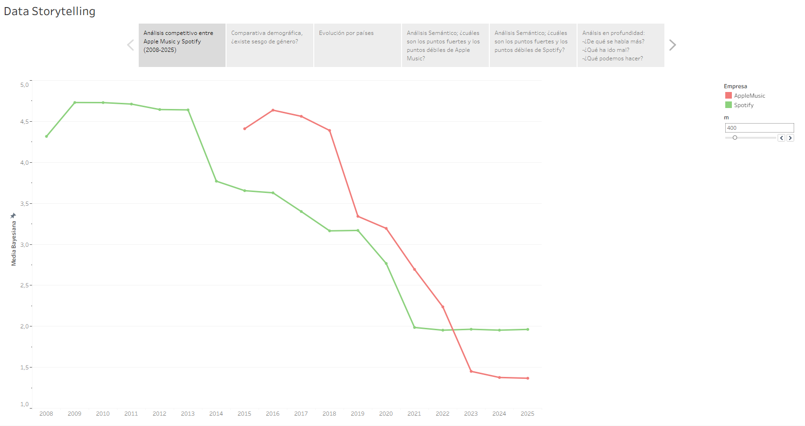
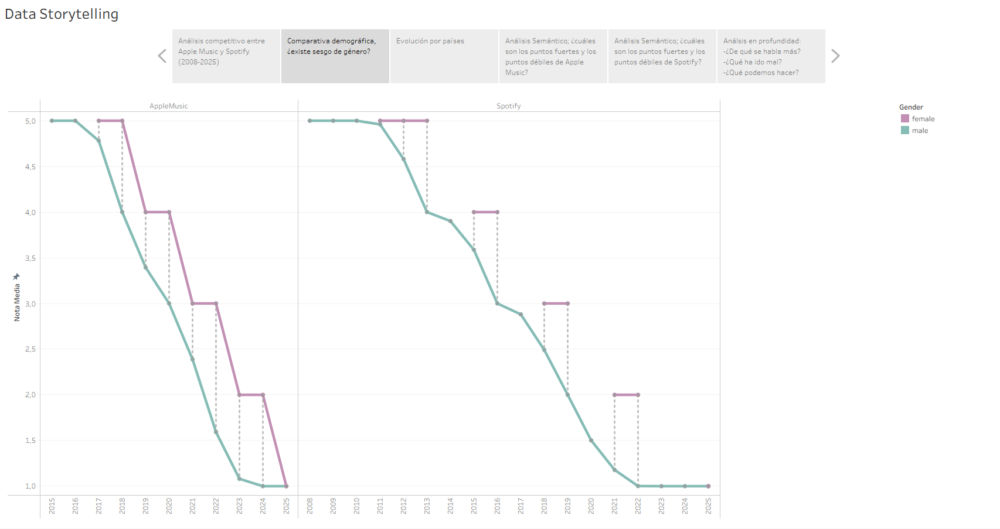
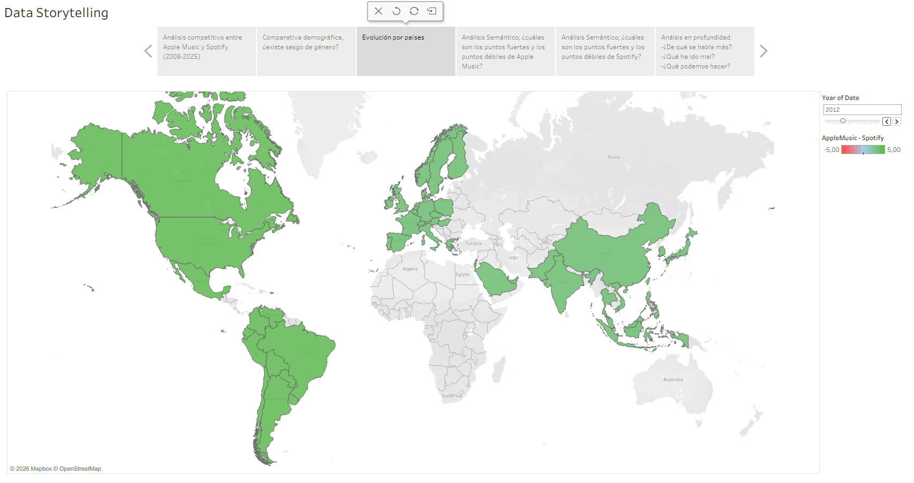
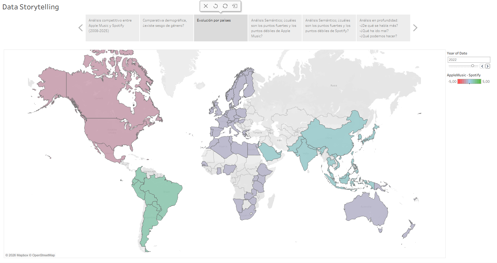
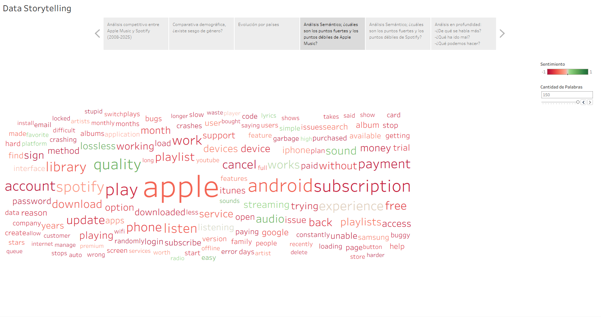
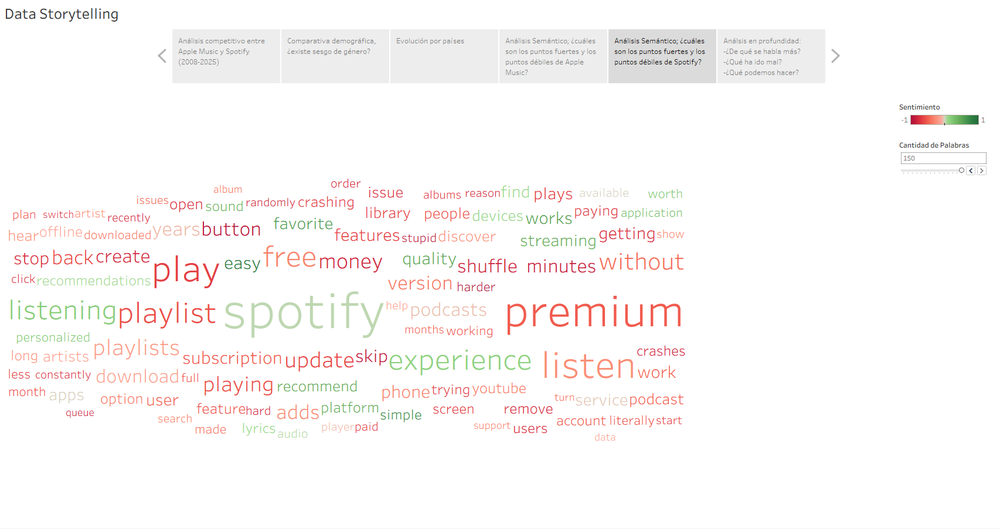
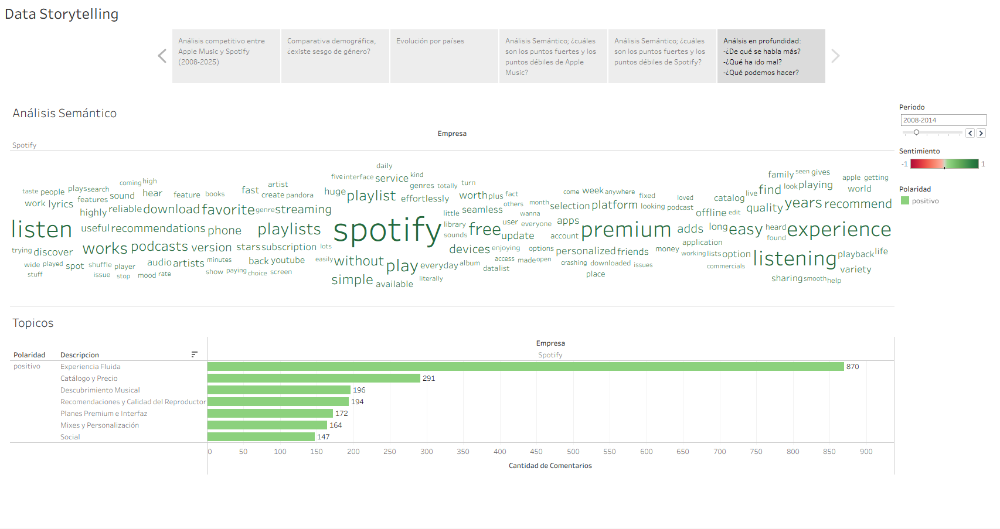
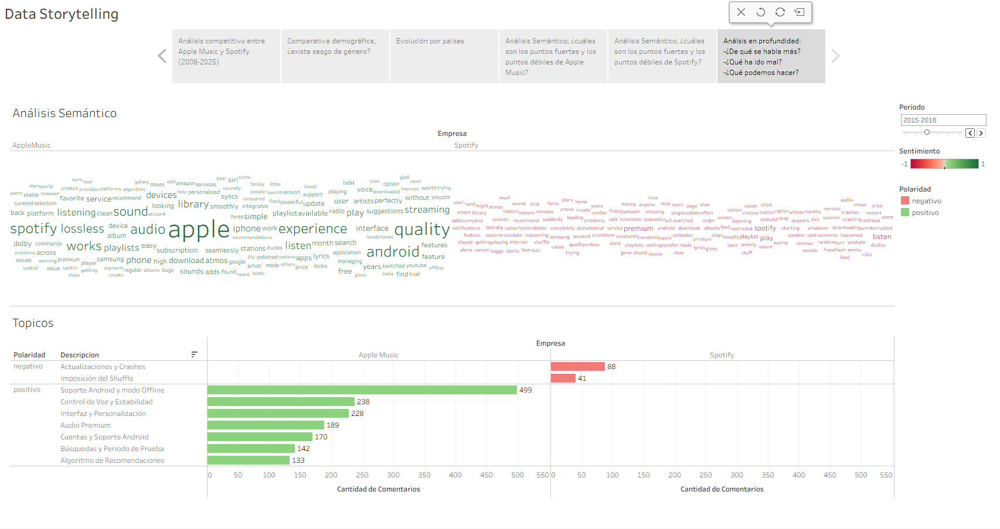

- [Evolución Anual de las reviews](#evolución-anual-de-las-reviews)
  - [Justificación del uso de la media bayesiana](#justificación-del-uso-de-la-media-bayesiana)
  - [Lectura del gráfico](#lectura-del-gráfico)
- [Comparativa demográfica ¿existe sesgo de género?](#comparativa-demográfica-existe-sesgo-de-género)
- [Evolución por países](#evolución-por-países)
- [Análisis Semántico; Puntos fuertes y débiles](#análisis-semántico-puntos-fuertes-y-débiles)
  - [Apple Music](#apple-music)
  - [Spotify](#spotify)
- [Clustering y tópicos; Análisis en profundidad](#clustering-y-tópicos-análisis-en-profundidad)

---

# Evolución Anual de las reviews
## Justificación del uso de la media bayesiana
Como cada año tiene una cantidad distinta de reviews y estas no están distribuidas de forma balanceada entre años es necesario tener en cuenta la cantidad de reviews anuales a la hora de representar la evolución de la puntuación. Por eso usamos la media bayesiana para generar la gráfica: https://en.wikipedia.org/wiki/Bayesian_average

M es la cantidad de reviews de las que nos "fiamos", los años con menos reviews que m son aplanados hacia la media global de todos los años para reducir el impacto de tener pocas reviews. (En la presentación se puede cambiar de forma interactiva)

## Lectura del gráfico
Ambas empresas muestran la misma tendencia, un par de años iniciales donde se mantienen con una buena nota media y un declive constante todos los años.

Hay sobretodo cuatro franjas importantes en el gráfico:
- 2008-2014: Spotify no tiene competencia.
- 2015-2018: Aparece AppleMusic cuando Spotify está bajando por problemas de su plan gratuito.
- 2019-2022: Bajada estable de ambos de notas neutras a notas negativas.
- 2023-2025: Estancamiento en notas negativas y tendencia al uno.

Se entiende que hay un descontento general con ambas plataformas, y al sostenerse tanto en el tiempo el problema ha de ser estructural o de negocio más que un error o actualización puntual.

---

# Comparativa demográfica ¿existe sesgo de género?

---

# Evolución por países

---

# Análisis Semántico; Puntos fuertes y débiles

## Apple Music

## Spotify

---

# Clustering y tópicos; Análisis en profundidad

---